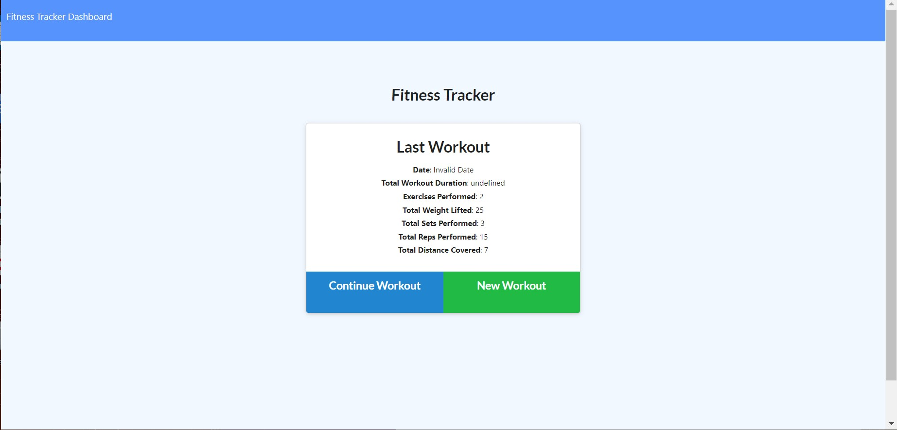
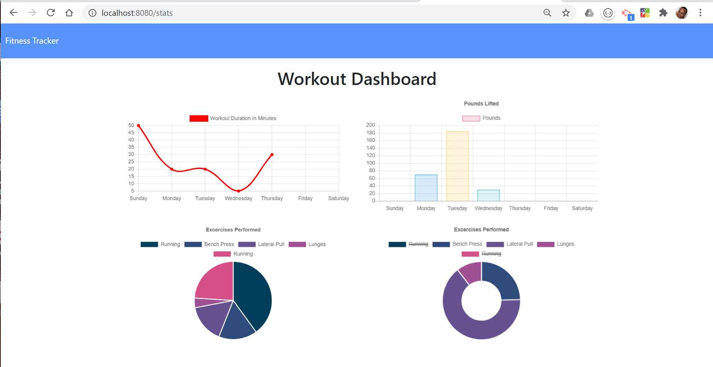
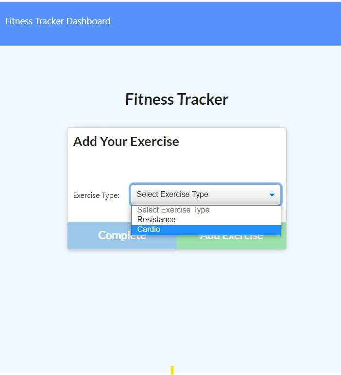
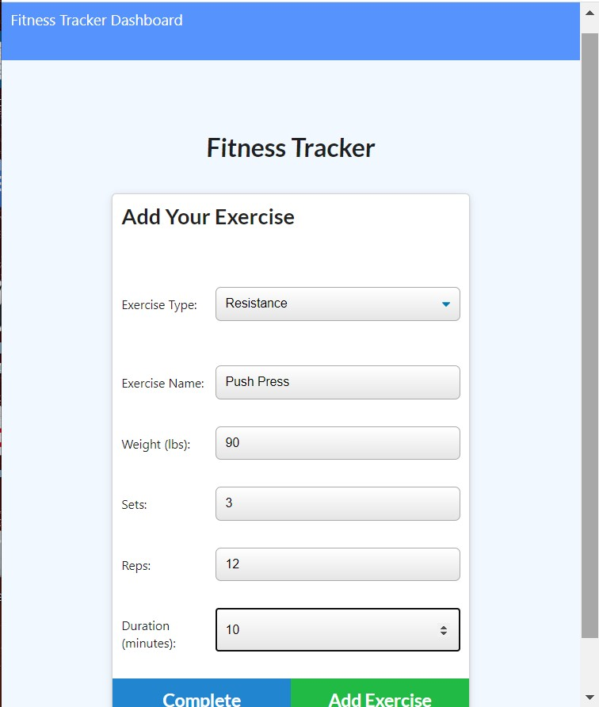

# Tracker

# Table of Contents

- [Description](#description)
- [Installation](#installation)
- [Usage](#usage)
- [Contributors](#contributors)
- [GitHub Informationl](#github-information)
- [Links](#links)
- [Credits](#credits)

# Description

The Workout Tracker makes it easy for you to record your cardio and resistance training workouts by: time, weight-lbs, type-exercise and distaince,

# Usage

Usages and some basic functionailty

# Contributors

- @CarlVegaTA
- @BorjanBartula
- @tylerhbray
- @wilsonhorrell

# https://github.com/kobac44

> 

# Links
* https://kobac44.github.io/Tracker/
* Heroku:https://limitless-eyrie-09715.herokuapp.com/

## Acceptance Criteria

When the user loads the page, they should be given the option to create a new workout or continue with their last workout.

The user should be able to:

- Add exercises to a previous workout plan.

- Add new exercises to a new workout plan.

- View the combined weight of multiple exercises on the `stats` page.
